# LESS 动态样式语言

***陈华旺-chenhuawang@itany.com***

[TOC]

## 1、LESS简介

+ Less 是一个**Css 预编译器**,意思指的是它可以扩展Css语言,添加功能如允许变量(variables),混合(mixins),函数(functions) 和许多其他的技术，让你的Css更具维护性，主题性，扩展性。
+ Less 可运行在 Node 环境,浏览器环境和Rhino环境.同时也有3种可选工具供你编译文件和监视任何改变。

## 2、LESS的使用

### 2.1、Node环境下得LESS编译器

+ 可在NODE环境下 安装 全局LESS 编译器，`[sudo]  npm install less -g` ，全局编译命令 **`lessc`**

+ 对less 文件进行编译 `lessc style.less > style.css`

  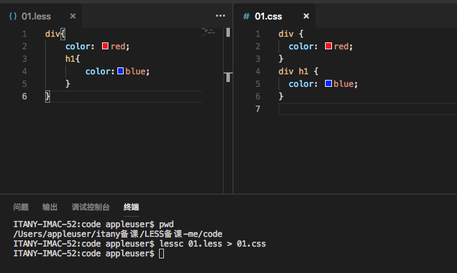

### 2.2、vscode 插件自动编译

+ 在vscode编译器安装 **Easy LESS** 编译器，可在.less文件被保存时，自动在相同位置 编译并保存 一个同名的 .css文件

  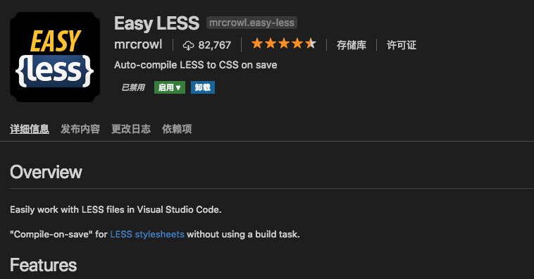

### 2.3、浏览器自动编译

+ LESS提供 JS 文件版本的 HTML 自动编译插件，可在相关页面直接使用 LESS语法

```html
<!DOCTYPE html>
<html lang="en">
<head>
    <meta charset="UTF-8">
    <meta name="viewport" content="width=device-width, initial-scale=1.0">
    <meta http-equiv="X-UA-Compatible" content="ie=edge">
    <title>Document</title>
    <!-- <script src="./js/less.min.js"></script> -->
    <!-- 传统CSS -->
    <!-- <style type="text/css">
        div{
            color:red;
        }
        div h1{
            color: blue;
        }
    </style> -->
    <!-- 
        less 语法 
        一定要 指定 语法类容
        且 代码需要在 编译文件之前
    -->
    <style type="text/less">
        div{
            color:red;
            h1{
                color: blue;
            }
        }
    </style>
    <script src="./js/less.min.js"></script>
</head>
<body>
    <div>
        测试
        <h1>测试</h1>
    </div>
    <h1>比较</h1>
</body>
</html>
```

### 2.4、GULP 自动化工作流编译

+ 在项目中 新建 gulp 工作流 使用 工作流自动完成less 编译
+ 依赖编译包 `gulp-less`

```js
// gulpfile 文件 ==> watch bug 修复
const gulp = require("gulp");
const less = require("gulp-less");
const watch = require("gulp-watch");

gulp.task("less",function(){
    gulp.src("./less/**/*.less")
        .pipe(less())
        .pipe(gulp.dest("css"));
});

gulp.task("watch",function(){
    watch("./less/**/*.less",function(){
        gulp.start('less');
    })
}); 

gulp.task("default",["less","watch"],function(){
    console.log("启动LESS自动编译……");
    console.log("============================");
});
```

## 3、LESS的基础语法

### 3.1、LESS注释

+ 编译保留注释 `/*  */`，编译后的css文件中会保留该注释
+ 编译删除注释` // ` ，编译后的css文件中不会保留该注释（**静默注释**）

### 3.2、LESS的变量定义

+ LESS 的值变量定义：`@变量名:变量值;`，定义后的变量可在 css 选择器中直接使用 `@变量名`

```less
/* 保留注释 */
// 删除注释

// 1.基础变量定义
@white: #fff;
@light: #f8f9fa;
@gray: #6c757d;
@secondary: #6c757d;
@gray-dark: #343a40;
@dark: #343a40;
@blue: #007bff;
@indigo: #6610f2;
@purple: #6f42c1;
@pink: #e83e8c;
@red: #dc3545;
@orange: #fd7e14;
@yellow: #ffc107;
@green: #28a745;
@teal: #20c997;
@cyan: #17a2b8;

@size:20px;

// 变量可引用变量
@link-color:@cyan;
@link-color-hover:@green;

// 变量可使用 驼峰命名法
@textDecoration:none;

// 变量支持多值定义
@border:1px solid @pink;

div{
    color:@dark;
    background-color: @blue;
}
#aa{
    font-size: @size;
    padding: 10px @size;
}
a:link{
    color: @link-color;
    text-decoration: @textDecoration;
}
a:hover{
    color: @link-color-hover;
    text-decoration: @textDecoration;
}
li{
    border: @border;
}
```

+ LESS 路径变量定义：`@变量名:值`，定义后可在属性值上使用 ,`@{变量名}`

  **LESS 中除去 基本变量定义外，其它变量定义 在使用时 都需要进行 @{变量名} 获取**

```less
// 2、路径变量定义
@img-base-url:"./imgs";
div{
    // 使用是@{变量名} 不能出现多余空格
    // background-image: url("@{ img-base-url }/logo.png");
    background-image: url("@{img-base-url}/logo.png");
}
```

+ LESS 选择器变量定义：`@变量名:值`，定义后可在选择器上使用 ,`@{变量名}`

```less
// 3、选择器变量定义
@select1: banner;
.@{select1} {
  font-weight: bold;
  line-height: 40px;
  margin: 0 auto;
}
div #@{select1}{
    color: @red;
}
```

+ LESS 属性变量定义：`@变量名:值`，定义后可在选择器上使用 ,`@{变量名}`，`前缀-@{变量名}`

```less
// 4、属性变量定义
@property: color;
.widget {
  @{property}: #0ee;
  background-@{property}: #999;
}
@chrome:-webkit;
@firefox:-moz;
@ie:-ms;
@opera:-o;
div{
    transform: rotate(7deg);
    @{chrome}-transform: rotate(7deg);
    @{firefox}-transform: rotate(7deg);
    @{ie}-transform: rotate(7deg);
    @{opera}-transform: rotate(7deg);
}
```

+ LESS 可变变量定义：`@变量名:值`，定义后可在选择器上使用 ,`@@变量名`

```less
// 5、可变变量使用
@size:24px;
@name:size;
.section {
  font-size: @@name;
}
```

+ LESS 变量作用域：变量可以定义在整改 LESS文件的顶级 作为 **全局变量存在**，也可以定义在选择器的内部 作为 **局部变量存在**

```less
// 6、变量作用域
h1{
    color: @red;
    // 无法加载 @aa变量
    // border: @aa;
}
h2{
    @red:blue;
    @aa:1px solid @red;
    color: @red;
    border: @aa;
}
h3{
    color: @red;
    // 无法加载 @aa变量
    // border: @aa;
}
```

+  变量懒加载：LESS 允许 先使用变量 后定义变量

```less
// 7、变量懒加载
ul{
    color: #007bff;
    border: 1px solid @cc;
}
@cc:#dedede;
```

+ 变量默认值：LESS 中可通过定义变量先后的方式，实现变量默认值的操作,**无论后定义的变量在less文件的什么位置，less文件中所有引用该变量的属性都会改变**

### 3.3、选择器嵌套

+ LESS 语法中允许实现 选择中定义选择器的语法，可以快速实现 选择器嵌套规则

```less
// 选择器嵌套
@white: #fff;
@light: #f8f9fa;
@gray: #6c757d;
@secondary: #6c757d;
@gray-dark: #343a40;
@dark: #343a40;
@blue: #007bff;
@indigo: #6610f2;
@purple: #6f42c1;
@pink: #e83e8c;
@red: #dc3545;
@orange: #fd7e14;
@yellow: #ffc107;
@green: #28a745;
@teal: #20c997;
@cyan: #17a2b8;

ul{
    list-style: none;
    li{
        font-size: 12px;
        color: @orange;
        > a{
            text-decoration: none;
        }
        > i{
            color: @secondary;
        }
    }
}

div{
    color: @cyan;
    p,h1,h2,h3,h4,h5,h6{
        padding: 0px;
        margin: 0px;
    }
}

table{
    border-collapse: collapse;
    @size:1px;
    th,tr{
        border: @size solid black;
        td{
            @size:2px;
            border-left:@size solid @red;
        }
    }
}
```

### 3.4、父级选择器名称替代符号：`&`

> less可以使用&符号在 选择器内部用于指向父级选择器名称。

+  父级选择器 经常被用在伪类 或 伪元素选择器上

```less
// 1、父级选择器 经常被用在伪类 或 伪元素选择器上
a{
    color: red;
    // 标示当前 a 标签中得 a 标签
    // a:hover{
    //     color: blue;
    // }
    &:hover{
        color: blue;
    }
}
div{
    font-size: 20px;
    &::after{
        content: "测试文本";
    }
}
```

+ 父级选择器 也可用在样式 分组中

  **完成样式名称的组合 不会实现 选择器的嵌套**

```less
// 2、父级选择器 也可用在样式 分组中
.btn{
    @success:#28a745;
    @error:#dc3545;
    @info:#17a2b8;
    @warning:#fd7e14;
    @border:1px solid;
    &-success{
        background-color:@success;
        border: @border @success;
    }
    &-error{
        background-color: @error;
        border: @border @error;
    }
    &-info{
        background-color: @info;
        border: @border @info;
    }
    &-warning{
        background-color: @warning;
        border: @border @warning;
    }
    &link{
        text-decoration: none;
    }
}
```

+ 多重样式名组合

```less
// 3、多重样式名组合
// 选择器的多重嵌套
.item{
    font-size: 12px;
    & div{
        color: red;
    }
    // 层级反转
    // 完成 同选择器中 的 多样式定义
    p &{
        color: blue;
        font-size: 20px;
    }
    .aa&{
        font-size: 36px;
    }
    // p .item {
    //     color: blue;
    // }
}


.link {
    & + & {
      color: red;
    }
    & & {
      color: green;
    }
    && {
      color: blue;
    }
    &, & {
      color: cyan;
    }
    & > & {
        color: orange;
    }
}
```

+ 多级父选择器

```less
// 4、多级父选择器
// & 标示父级所有选择器，不关心选择器层级
.content .info{
    &:hover{
        color: red;
    }
    & &{
        font-size: 20px;
    }
}
.nav{
    .nav-bar{
        & > &{
            color: red;
        }
    }
}
```

+ 分组选择器迭代

```less
// 5、分组选择器迭代
h1,h2,h3,h4,h5,h6,p{
    margin: 0px;
    // LESS 会使用两两配对的方式 实现 选择器组合
    & &{
        padding: 0px;
    }
}
```

### 3.5、样式继承

> LESS 允许对相同样式进行继承操作，减少对相同样式的重复定义
>
> **继承常被用在 重复独立样式的 加载和引用中**

```less
// 样式继承
.tip{
    width: 200px;
    height: 40px;
    font-size: 20px;
    line-height: 40px;
    text-align: center;
    color: white;
    background-color: #6f42c1;
    a{
        text-decoration: none;
        &:hover{
            color: blue;
        }
    }
    .text{
        margin: 10px;
        padding: 10p;
    }
}

.border-tip{
    // 实现对现有样式的继承操作
    // LESS 只会完成对 指定样式的继承，不会继承其子选择的设置
    // LESS 中 继承依然可以使用 css的相关层级选择器，进行定位，但无法直接继承非同级选择器
    &:extend(.tip .text);
    border: 1px solid #6610f2;
}

.tip2{
    // 实现对样式继承时，写入 关键字 all 时，可完成所有属性继承，包括 子选择器的样式
    &:extend(.tip all);
    margin: 20px;
}

// 继承 伪类写法
// 继承相关选择器的样式
.tip3:extend(.tip .text){
    overflow: hidden;
}
// 继承可以使用 多继承方式
.tip4:extend(.tip):extend(.tip .text){
    display: inline;
}

// 继承 无法使用变量方式进行 匹配，extend 会直接忽略
@name:aaa;
.@{name}{
    color: red;
}
div:extend(@{name}){
    font-size: 20px;
}
```

### 3.6、样式混合

####3.6.1、简单混合器

+ LESS 允许进行样式预定义，并使用混合语法将预定义样式 加载进行 指定样式中
+ LESS 中**除包含标签选择器、伪类选择器、伪元素选择器，以外的其它选择器**，均可以作为 混合样式使用
+ LESS 在混合样式时，会将指定的混合器中所有的样式和层级进行组合

```less
// 样式混合
// 1、简单混合
.wbs{
    font-size: 24px;
}
#aa{
    text-decoration: underline;
}
div{
    padding: 10px;
}
#dd .ff{
    background-color: white;
}
.pp #ll{
    margin: 10px;
}
#dd div{
    font-family: 'Courier New', Courier, monospace;
}
.link:hover{
    color: red;
}
// 混合器 组合样式时，会将选择器 所有层级进行 整体组合
#itany{
    font-weight: bold;
    a{
        color: blue;
    }
}

.cc{
    display: inline-block;
    .wbs;
    #aa;
    // div;
    #dd .ff;
    .pp #ll;
    // #dd div;
    // .link:hover;
    #itany;
}
```

#### 3.6.2、带参混合器

+ LESS 允许定义 一个类似函数的 带参混合器，该混合器无法作为普通选择器进行使用，但允许在调用该混合器时 使用 自定义数据
+ 混合器定义：`混合器选择器(变量,……){样式}`
+ 混合器使用：`普通选择器{混合器选择器(变量,……);}`

```less
// 带参混合器
#font-color(@color){
    color: @color;
}
.border(@width,@style,@color){
    border: @width @style @color;
}
table{
    border-collapse: collapse;
    #font-color(red);
    td{
        font-size: 12px;
        .border(1px, solid, black);
    }
}
ul{
    list-style: none;
    #font-color(blue);
    li{
        font-size: 12px;
        .border(2px, dashed, yellow);
    }
}

// 参数默认值
.setColumns(@columns:100px 2,@column-fill:auto,@column-gap:10px,@column-rule:2px dashed blue){
    columns: @columns;
    column-fill: @column-fill;
    column-gap: @column-gap;
    column-rule: @column-rule;
}
#d1{
	width:400px;
	.setColumns(100px 3,balance,5px,1px solid red);
}
#d2{
	width:400px;
	.setColumns;
}
// 案例
#hover(@target,@size,@color){
    &{
       font-size: @size;
    }
    @{target}:hover{
        color: @color;
    }
}

ul{
    list-style: none;
    li{
        padding: 10px 0px;
        #hover(a, 20px, red);
    }
}
```

#### 3.6.3、导引混合器

+ LESS 允许定义 根据条件进行 参数选择的混合器，类似于 JS 中得 `switch case`，在LESS 中被成为 导引表达式

```less
// 导引混合器
// 导引表达式，即使用when进行判断
.hello(@font-size) when(@font-size<20){
	font-size:@font-size;
	color:red;
}
.hello(@font-size) when(@font-size>=20){
	font-size:30px;
	color:blue;
}
.hello(@font-size){ //总是会匹配
	background-color: #ccc;
}
.c2{
	.hello(18px);
}
.c3{
	.hello(50px);
}
```

## 4、LESS的四则运算

+ LESS 中支持对部分CSS数据进行 四则运算

```less
@num1:21px;
@num2:@num1+4px;
@num3:@num1+@num2;
@num4:(@num1+3)*2;
// @num5:@num1%2;
@num5:@num1/2;
@color:#666/2;
@bgColor:@color+#222;
@color2:#123456+#234;//颜色双位相加

#d1{
	font-size: @num2;
    font-size: @num3;
    font-size: @num4;
    font-size: @num5;
	color:@color;
	border:unit(@num1/2+3,px) dashed red; 
    background-color: @bgColor;
    background-color: @color2;
}
```

## 5、LESS 内置函数

### 5.1、图片函数

+ LESS 内置的图片函数，主要用于获取图片的长宽像素,**图像长宽函数 只能在node环境中使用** 和 base64转换
  + image-size ：从文件获取的图像尺寸。
    + 参数： string: 获取尺寸的文件。
    + 返回：宽px 高px
  + image-width：从文件获取的图像宽度。
    + 参数： string: 获取尺寸的文件。
    + 返回： 宽px
  + image-height：从文件获取的图像高度。
    + 参数： string: 获取尺寸的文件。
    + 返回： 高px

```less
// 图片函数
// image-size 获取图片的长宽
h2{
    padding: image-size("../imgs/logo.png");
} 
img{
    width: image-width("../imgs/qq.jpeg");
    height: image-height("../imgs/qq.jpeg");
}
```

### 5.2、单位函数

+ LESS 内置对 数值单位进行转换和处理的函数

  + convert(arg1,arg2)：将数字从一种单位 计算转换到 另一种类型。

    + 第一个参数为带单位的数值，第二个参数为单位。

      > 如果两个参数的单位是兼容的，则数字的单位被转换。如果两个参数的单位不兼容，则原样返回第一个参数。

    + 兼容的单位组:

      > 长度: m, cm, mm, in, px 
      >
      > 时间: s  ms,
      >
      > 角度: rad, deg

    + 返回： number

  + unit(arg1,arg2) ：移除或者改变属性值的单位。

    + 参数：

      > arg1: 数字，带或不带单位。
      >
      > arg2: 可选参数，将要替换成的单位，如果省略则移除原单位。

```less
// 单位函数
//convert()函数
.c2{
	animation-delay: convert(3000ms,s);
	transition-duration: convert(2s,ms);
	width: convert(20mm,px);
	transform: rotate(convert(0.5rad,deg));
	height: convert(30deg,px); //无法转换，返回原始数据
}
//unit()函数
.c1{
	font-size:unit(20,px);
	font-size: unit(20px,rem);
	font-size: unit(20px);//删除单位
}
```

### 5.3、字符串函数

+ 字符串替换函数

  + replace （替换）： 用另一个字符串替换文本.

    + 参数：

      > string: 搜索和替换用的字符串.
      >
      > pattern:一个字符串或者能搜索的正则表达式.
      >
      > replacement: 匹配模式成功的替换字符串.
      >
      > flags: (可选的) 正则表达式匹配标识（全匹配还是...）.

    + 返回： 替换过值后的字符串.

```less
// 字符串函数
//replace()函数
#d1:after{
	content:replace("welcome to itany.","o","O");
	content:replace("welcome to itany.","o","O",g);
	content:replace("this is string.","(string)","new $1"); //$1是占位符，表示第1个匹配值
	content:replace("welcome to nanjing.","^welcome to nanjing.$","aa");
}
```

### 5.4、列表函数

+  length (长度) ：返回集合中的值的数目.
  + 参数： `list` - **以空格或逗号隔开**的值集合。 
  + 返回： 集合的**值**个数。
+ extract (提取) ：返回集合中指定索引的值。
  + 参数：
    +  `list` - 逗号或者空格隔开的值集合。
    +  `index` - 用于返回集合中指定位置值的整型数字。 
  + 返回： 集合指定位置处的值。 

```less
// 列表函数
//length()函数
@names1:"tom","jack","alice";
@names2:"tom" "jack" "alice" "mike";
@str:"aabbcc";
#d1{
	font-size:unit(length(@names1),rem);
	font-size:unit(length(@names2),rem);
	font-size:unit(length(@str),rem);
}

//extract()函数
@myBorder:2px solid red;
#d2{
	border: @myBorder;
	color:extract(@myBorder,3); //提取第3个字段
	font-size: unit(extract(@myBorder,1),rem);
}
```

### 5.5、数学函数

+ ceil ：向上取整。

  + 参数： `number` - 浮点数。

  + 返回： `integer`

    > 示例： `ceil(2.4)`
    >
    > 输出： `3`

+ floor：向下取整。

  + 参数： `number` - 浮点数。

  + 返回： `integer`

    > 示例： `floor(2.6)`
    >
    > 输出： `2`

+ percentage：将浮点数转换为百分比字符串。

  + 参数： `number` - 浮点数。

  + 返回： `string`

    > 示例： `percentage(0.5)`
    >
    > 输出： `50%`

+ round：四舍五入

  + 参数：`number`： 浮点数 `decimalPlaces`： 可选参数，四舍五入取整的小数点位置，默认值为0。

  + 返回： `number`

    > 示例： `round(1.67)`
    >
    > 输出： `2`
    >
    > 示例： `round(1.67, 1)`
    >
    > 输出： `1.7`

+ sqrt：计算一个数的平方根，原样保持单位。

  + 参数： `number` - 浮点数。

  + 返回： `number`

    > 示例：sqrt(25cm)
    >
    > 输出：5cm
    >
    > 示例：sqrt(18.6%)
    >
    > 输出：4.312771730569565%;

+ abs： 计算数字的绝对值，原样保持单位。

  + 参数： `number` - 浮点数。

  + 返回： `number`

    > 示例 #1： `abs(25cm)`
    >
    > 输出： `25cm`
    >
    > 示例 #2： `abs(-18.6%)`
    >
    > 输出： `18.6%;`

+ sin： 正弦函数。**处理时会将没有单位的数字认为是弧度值。**

  + 参数： `number` - 浮点数。

  + 返回： `number`

    > 示例：
    >
    > sin(1); // 1弧度角的正弦值
    > sin(1deg); // 1角度角的正弦值
    > sin(1grad); // 1百分度角的正弦值
    >
    > 输出：
    >
    > 0.8414709848078965; // 1弧度角的正弦值
    > 0.01745240643728351; // 1角度角的正弦值
    > 0.015707317311820675; // 1百分度角的正弦值

+ asin： 反正弦函数。**返回以弧度为单位的角度，区间在 `-π/2` 到 `π/2` 之间。**

  + 参数： `number` - 区间在 `[-1, 1]` 之间的浮点数。

  + 返回： `number`

    > 示例：
    >
    > asin(-0.8414709848078965)
    > asin(0)
    > asin(2)
    >
    > 输出：
    >
    > -1rad
    > 0rad
    > NaNrad

+ cos： 余弦函数。**处理时会将没有单位的数字认为是弧度值。**

  + 参数： `number` - 浮点数。

  + 返回： `number`

    > 示例：
    >
    > cos(1) // 1弧度角的余弦值
    > cos(1deg) // 1角度角的余弦值
    > cos(1grad) // 1百分度角的余弦值
    >
    > 输出：
    >
    > 0.5403023058681398 // 1弧度角的余弦值
    > 0.9998476951563913 // 1角度角的余弦值
    > 0.9998766324816606 // 1百分度角的余弦值

+ acos： 反余弦函数。**返回以弧度为单位的角度，区间在 `0` 到 `π` 之间。**

  + 参数： `number` - 区间在 `[-1, 1]` 之间的浮点数。

  + 返回： `number`

    > 示例：
    >
    > acos(0.5403023058681398)
    > acos(1)
    > acos(2)
    >
    > 输出：
    >
    > 1rad
    > 0rad
    > NaNrad

+ tan： 正切函数。**处理时会将没有单位的数字认为是弧度值。**

  + 参数： `number` - 浮点数。

  + 返回： `number`

    > 示例：
    >
    > tan(1) // 1弧度角的正切值
    > tan(1deg) // 1角度角的正切值
    > tan(1grad) // 1百分度角的正切值
    >
    > 输出：
    >
    > 1.5574077246549023   // 1弧度角的正切值
    > 0.017455064928217585 // 1角度角的正切值
    > 0.015709255323664916 // 1百分度角的正切值

+ atan： 反正切函数。**返回以弧度为单位的角度，区间在 `-π/2` 到 `π/2` 之间。**

  + 参数： `number` - 浮点数。

  + 返回： `number`

    > 示例：
    >
    > atan(-1.5574077246549023)
    > atan(0)
    > round(atan(22), 6) // 22四舍五入保留6位小数后的反正切值
    >
    > 输出：
    >
    > -1rad
    > 0rad
    > 1.525373rad;

+ pi： 返回 π (pi);

  + 参数： `none`

  + 返回： `number`

    > 示例：pi()
    >
    > 输出：3.141592653589793

+ pow： 乘方运算。**假设第一个参数为A，第二个参数为B，返回A的B次方。返回值与A有相同单位，B的单位被忽略。**

  + 参数：`number`： 基数 - 浮点数。`number`： 冪指数 - 浮点数。

  + 返回： `number`

    > 示例：
    >
    > pow(0cm, 0px)
    > pow(25, -2)
    > pow(25, 0.5)
    > pow(-25, 0.5)
    > pow(-25%, -0.5)
    >
    > 输出：
    >
    > 1cm
    > 0.0016
    > 5
    > NaN
    > NaN%

+ mod： 取余运算。**假设第一个参数为A，第二个参数为B，返回A对B取余的结果。返回值与A有相同单位，B的单位被忽略。这个函数也可以处理负数和浮点数。**

  + 参数：`number`： 浮点数。`number`： 浮点数。

  + 返回： `number`

    > 示例：
    >
    > mod(0cm, 0px)
    > mod(11cm, 6px);
    > mod(-26%, -5);
    >
    > 输出：
    >
    > NaNcm;
    > 5cm
    > -1%;

+ min： 最小值运算。

  + 参数： `value1, ..., valueN` - 一个或多个待比较的值。

  + 返回： 最小值。

    > 示例： `min(5, 10);`
    >
    > 输出： `5`
    >
    > 示例： `min(3px, 42px, 1px, 16px);`
    >
    > 输出： `1px`

+ max： 最大值运算。

  + 参数： `value1, ..., valueN` - 一个或多个待比较的值。

  + 返回： the highest value.

    > 示例： `max(5, 10);`
    >
    > 输出： `10`
    >
    > 示例： `max(3%, 42%, 1%, 16%);`
    >
    > 输出： `42%`

### 5.6、颜色函数

####5.6.1、颜色操作函数

​	颜色值运算有几点注意事项：参数必须单位/格式相同；百分比将作为绝对值处理，比如 10% 增加 10%，结果是 20% 而不是 11%；参数值只能在限定的范围内；they do not wrap around (这一句不清楚意思，可能是指参数值不会在超过范围后自动从另一侧“穿越”回去。)。返回值时，除了十六进制的颜色值 (hex versions) 外将对其他格式做简化处理。

+ saturate ： 增加一定数值的颜色饱和度。

  + 参数：`@color`: 颜色对象  `@amount`: 百分比 0-100%

    > 示例： `saturate(#80e619, 20%)`
    >
    > 输出： `#80ff00 `
    >
    > 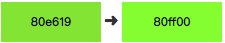
    >
    > 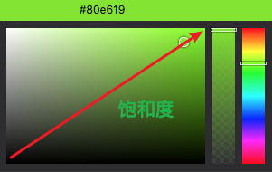

+ desaturate : 降低一定数值的颜色饱和度。

  + 参数：`color`: 颜色对象.  `amount`: 一个百分比 0-100%.

    > 示例： `desaturate(#80e619, 20%)`
    >
    > 输出： `#80cc33 `
    >
    > 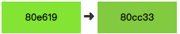

+ lighten:增加一定数值的颜色亮度。

  + 参数：`color`: 颜色对象. `amount`: 一个百分比 0-100%.

    > 示例： `lighten(#80e619, 20%)`
    >
    > 输出： `#b3f075 `
    >
    > 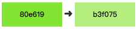
    >
    > 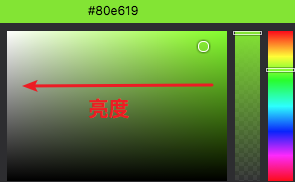

+ darken:降低一定数值的颜色亮度。

  + 参数：`color`: 颜色对象. `amount`: 一个百分比 0-100%.

    > 示例： `darken(#80e619, 20%)`
    >
    > 输出： `#4d8a0f `
    >
    > 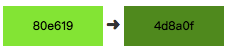

+ fadein：降低颜色的透明度（或增加不透明度），令其更不透明。**对不透明的颜色无效**

  + 参数：`color`: 颜色对象. `amount`: 一个百分比 0-100%.

    > 示例： `fadein(rgba(128, 242, 13, 0.5), 10%)`
    >
    > 输出： `rgba(128, 242, 13, 0.6) `

+ fadeout：增加颜色的透明度（或降低不透明度），令其更透明。**对不透明的颜色无效。**

  + 参数：`color`: 颜色对象. `amount`: 一个百分比 0-100%.

    > 示例： `fadeout(rgba(128, 242, 13, 0.5), 10%)`
    >
    > 输出： `rgba(128, 242, 13, 0.4) `

+ fade : 给颜色（包括不透明的颜色）设定一定数值的透明度。

  + 参数：`color`: 颜色对象(A color object)   `amount`: 百分比 0-100%

    > 示例： `fade(rgba(128, 242, 13, 0.5), 10%)`
    >
    > 输出： `rgba(128, 242, 13, 0.1) `

+ spin：任意方向旋转颜色的色相角度 (hue angle)。

  > 旋转范围 0-360，超过一周后将从起点开始继续旋转（+-控制方向），比如旋转360度与720度是相同的结果。
  >
  > 颜色值会通过RGB格式转换，这个过程不能保留灰色的色相值（灰色没有饱和度，色相值也就没有意义了），因此要确定使用函数的方法能够保留颜色的色相值
  >
  > 例如不要这样使用函数：`@c: saturate(spin(#aaaaaa, 10), 10%);`
  >
  > 而应该用这种方法代替：`@c: spin(saturate(#aaaaaa, 10%), 10);`

  + 参数：`color`: 颜色对象. `angle`: 任意数字表示角度 （+ 或 – 表示方向）

    > 示例：
    >
    > ​    color:spin(#f2330d, 30);
    >
    > ​    color:spin(#f2330d, -30);
    >
    > 输出：
    >
    >    color: #f2a60d;
    >
    >    color: #f20d59;
    >
    > 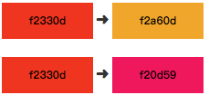
    >
    > 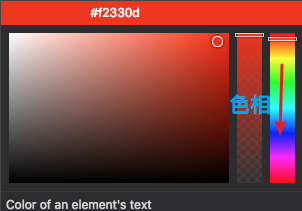

+ mix ：根据比例混合两种颜色，包括计算不透明度。

  + 参数：`color1`: 一个颜色对象.`color2`: 一个颜色对象.`weight`: 可选项：平衡两种颜色的百分比, 默认 50%。

    > 示例：
    >
    > mix(#ff0000, #0000ff, 50%)
    > mix(rgba(100,0,0,1.0), rgba(0,100,0,0.5), 50%)
    >
    > 输出：
    >
    > \#800080
    >
    > rgba(75, 25, 0, 0.75)
    >
    > 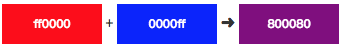

#### 5.6.2、颜色混合函数

+ multiply ：分别将两种颜色的红绿蓝 (RGB) 三种值做乘法运算，然后再除以255，输出结果是更深的颜色。

  + 参数：`@color1`: 颜色对象( A color object) `@color2`: 颜色对象( A color object)

  + **例如**:

    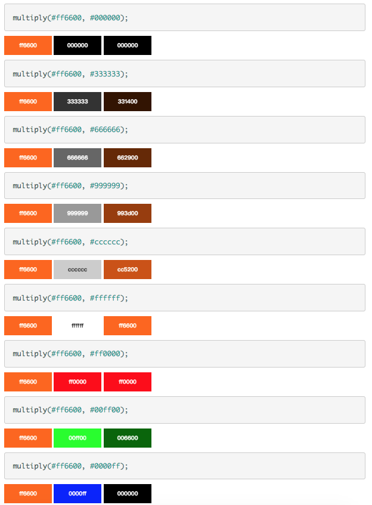

+ screen：与`multiply()` 函数效果相反，输出结果是更亮的颜色。

  + 参数：`@color1`: 颜色对象(A color object) `@color2`: 颜色对象(A color object)

  + **例如**:

    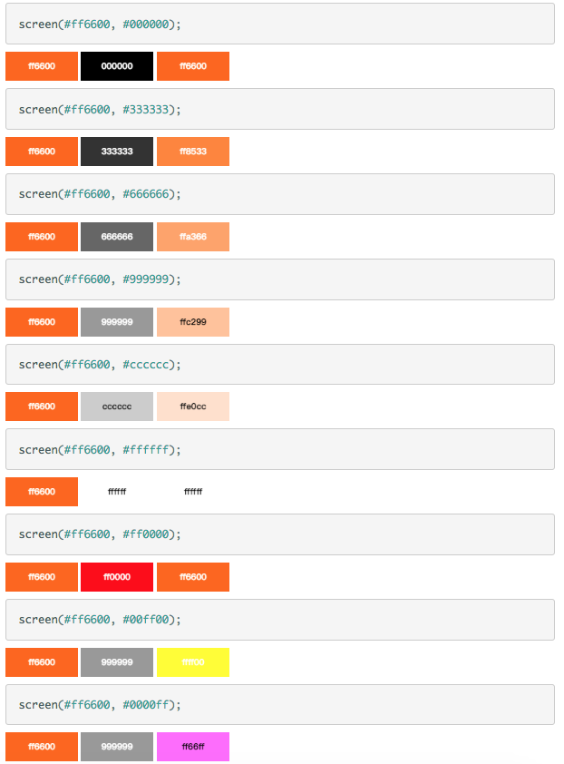 

+  overlay ：结合 `multiply()` 与 `screen()` 两个函数的效果，令浅的颜色变得更浅，深的颜色变得更深。**注意**：输出结果由第一个颜色参数决定。

  + 参数：`@color1`: 颜色对象，是用于叠加的颜色，也是结果是更亮还是更暗的决定因素。`@color2`: 颜色对象，被*叠加*的颜色。

  + **例如**:

    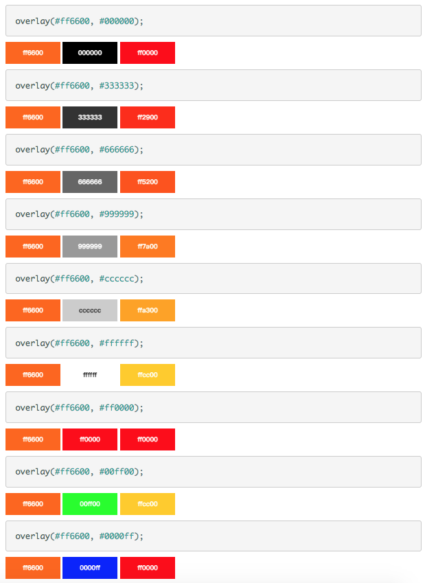

+ softlight ：与 `overlay()` 函数效果相似，只是当纯黑色或纯白色作为参数时输出结果不会是纯黑色或纯白色。

  + 参数：`@color1`: 混合色（光源） `@color2`: 被混合的颜色

  + **例如**:

    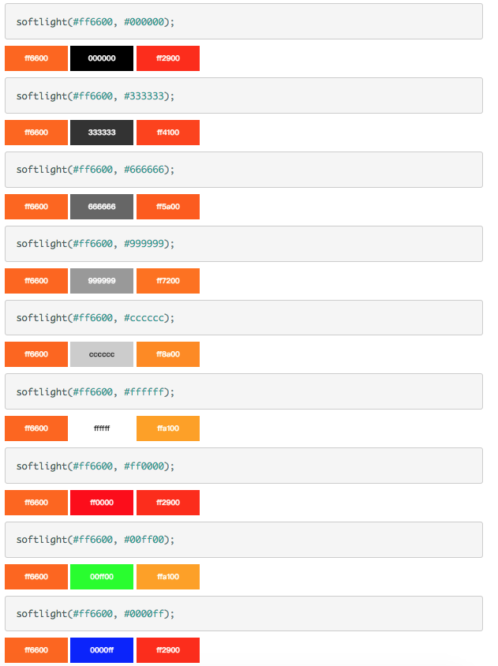

+ hardlight ：与 `overlay()` 函数效果相似，不过由第二个颜色参数决定输出颜色的亮度或黑度，而不是第一个颜色参数决定。

  + 参数：`@color1`: 混合色（光源） ，`@color2`: 颜色对象，用于叠加颜色，也是结果是更亮还是更暗的决定因素。

  + **例如**:

    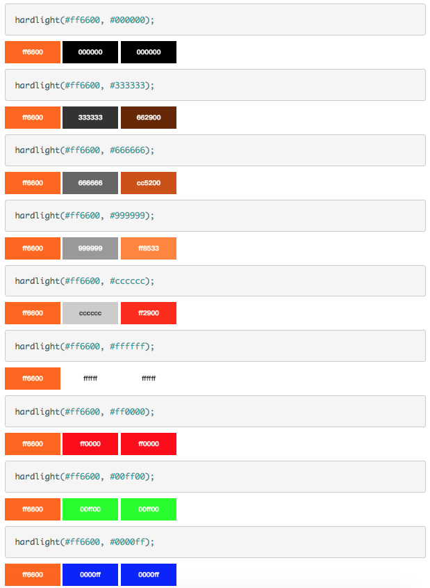

+ difference：从第一个颜色值中减去第二个（分别计算 RGB 三种颜色值），输出结果是更深的颜色。

  + 参数：`@color1`: 被减的颜色对象  `@color2`: 减去的颜色对象

  + **例如**:

    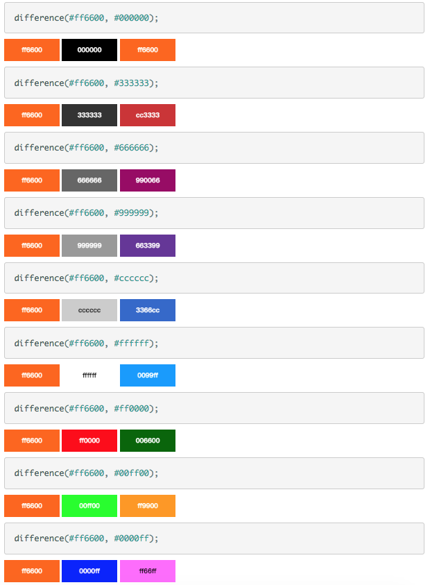

+ exclusion ：效果与 `difference()` 函数效果相似，只是输出结果差别更小 (lower contrast)。（译注：对应Photoshop中的“差值/排除”。）

  + 参数：`@color1`: 被减的颜色对象  `@color2`: 减去的颜色对象

  + **例如**:

    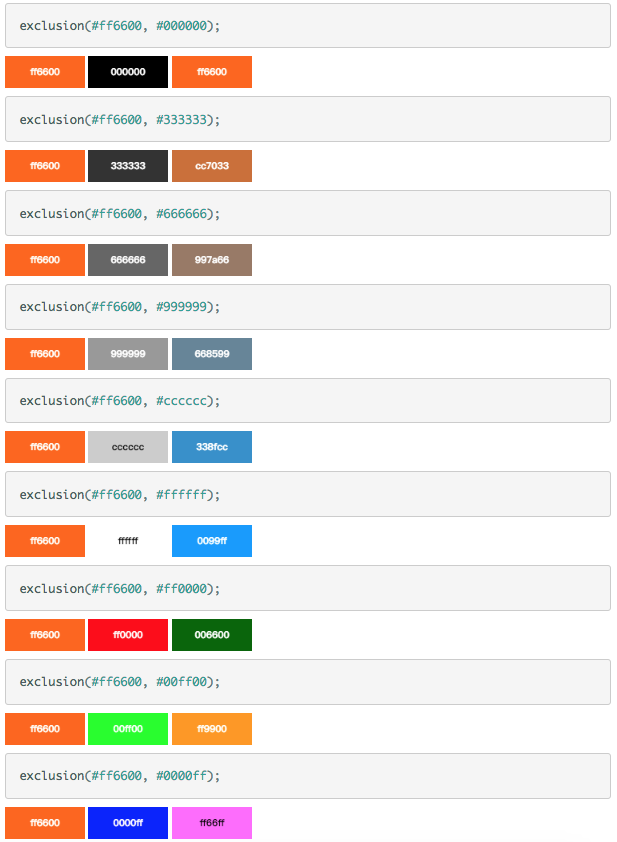

+ average ：分别对 RGB 的三种颜色值取平均值，然后输出结果。

  + 参数：`@color1`: 颜色对象(A color object)   `@color2`: 颜色对象(A color object)

  + **例如**:

    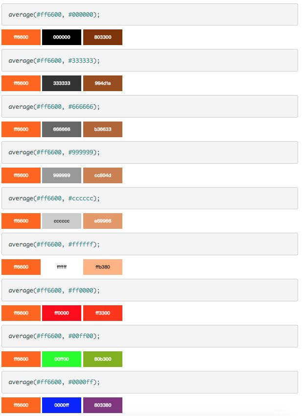 

+ negation ：与 difference() 函数效果相反，输出结果是更亮的颜色。请注意：效果相反不代表做加法运算。

  + 参数：`@color1`: 被减的颜色对象   `@color2`: 减去的颜色对象

  + **例如**:

    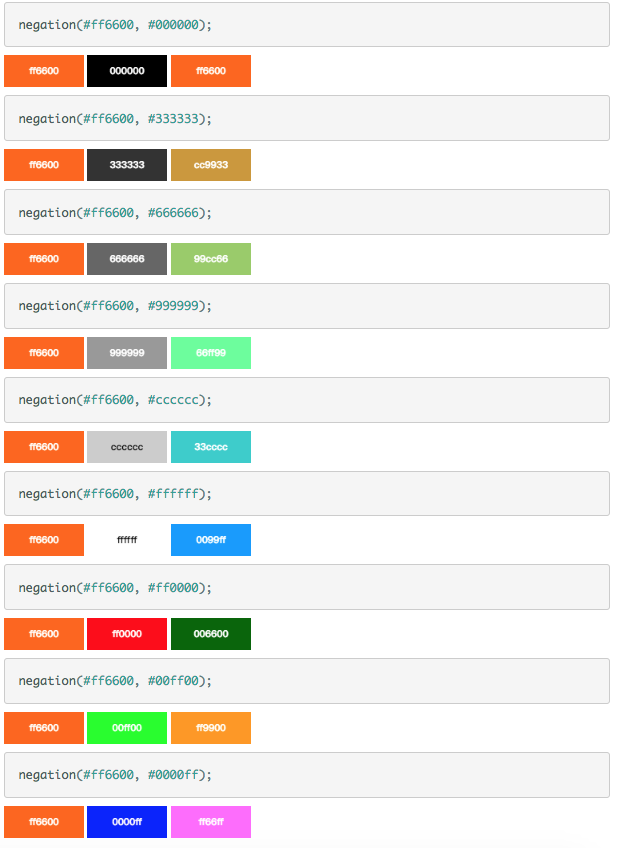

## 6、LESS 模块化

+ LESS 同样可以使用 模块方式 定义样式，且 LESS 不关心样式在何处导出，最终编译为CSS 时 都会整合为一个CSS文件

  **全局变量.less=var.less variables.less    **

  **混合.less= function.less  mixins.less  **

  ** 组件.less =compontens.less**

```less
// base/var.less
@white: #fff;
@light: #f8f9fa;
@gray: #6c757d;
@secondary: #6c757d;
@gray-dark: #343a40;
@dark: #343a40;
@blue: #007bff;
@indigo: #6610f2;
@purple: #6f42c1;
@pink: #e83e8c;
@red: #dc3545;
@orange: #fd7e14;
@yellow: #ffc107;
@green: #28a745;
@teal: #20c997;
@cyan: #17a2b8;

@size:20px;
```

```less
// @import "./base/var.less";
// @import "./base/var"; //less 导入可以省略扩展名
div{
    color: @red;
    font-size: @size;
}
@import "./base/var"; //less 导入可以写在文件的任何位置
```

## 7、CSS 编写的一点建议

+ 该建议是 **笔者** 在实际开发项目，和参考大量 前端框架 开发规范后，总结出得相关编写习惯。

> + BEM命名规范
>
>   BEM 是由Yandex团队提出的一种CSS Class 命名方法，旨在更好的创建CSS模块。
>
>   BEM的意思就是块（block）、元素（element）、修饰符（modifier）。
>
>   - block: 可以理解为一个区域、一个组件或者一个块级元素，具体如何区分需要根据实际情况具体分析；
>   - block__element： 就是一个上面的block里面的元素，比如说导航（nav：block）里面有a标签（a: element）就是一个元素， block与element使用两个下划线链接；（**结合各大框架，建议使用一个 -**）
>   - block_element--modifier： 我的理解是状态或属性。比如element里面的a标签，它有active、hover、normal三种状态，这三种状态就是modifier。midifier是使用两个“--”中横线连接（**结合各大框架，建议使用一个 -**）
>
>    ```html
>   <!-- HTML结构 -->
>   <nav class="nav">
>     <a href="#" class="nav-item nav-item-active">当前页：active</a>
>     <a href="#" class="nav-item nav-item-hover">假设鼠标在这里要加个hover的class</a>
>   </nav>
>    ```
>
>   ```less
>   // LESS写法
>   .nav{
>     &-item{
>       &-active{
>       }
>       &-hover{
>       }
>     }
>   }
>   .content{
>       &-news{
>           &-hover{
>               
>           }
>       }
>   }
>   ```
>
>   ```css
>   /* 编译后的css */
>   .nav{ }
>   .nav-item{ }
>   .nav-item-active{ }
>   .nav-item-hover{ }
>   ```
>
> + 合理的注释：一份可读性的CSS|LESS|SASS 必须有一份说明，一个文件，一个函数都需要一份说明。 对于一份LESS|SASS文件，你至少需要说明两点，是公用还是私有、哪个页面哪个部分
>
> + 动态样式语言，首先需要有一份variables（变量表），为提高开发效率打下基础，也是确保页面一致性的基础。
>
> + 动态样式语言 需要合理的模块化，模块化在js中经常听到，对于css来说，模块化对于易读性和可维护性同样重要。
>
>   + 多文件夹：分类存放动态语言文件。例如：将variables、mixin、公共样式、私有样式分成多个文件夹存放
>   + 多文件：同一个文件夹的动态样语言文件可以按模块、功能等等分成多个文件，最终用@import 导入
>
>   ```
>   |LESS
>     |variables                //基本变量
>     	-colors.less
>     	……
>     |mixin                 //函数
>     	……
>     |common                //公用
>       |header
>         ……
>       |aside
>         -list.less
>         -nav.less
>         -base.less
>     |compoment             //组件样式
>       |dropdown
>          ……
>       |lightbox
>          ……
>     |page
>       |index               //首页
>         -ad.less           //广告样式
>         -content.less      //内容信息
>         -info.less         //个人信息样式
>         -base.less         //index样式，@import 'ad';@import 'content';@import 'info';
>       |write  
>       	……
>       |preview        
>         -aside.less       //preview页面独有侧边栏
>       |about
>       	……
>     |main.less             //导入所需要的样式，最终生成一个main.css
>   ```
>
>   
>
>    
>
>    
>
>    
>
>    


